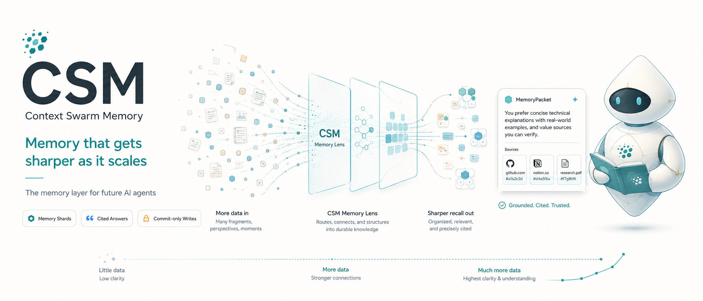
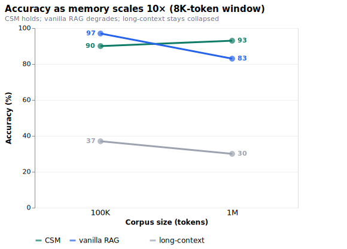
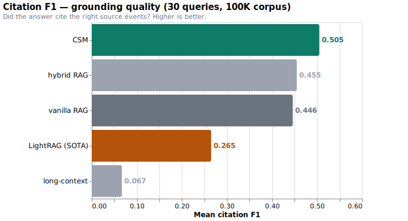
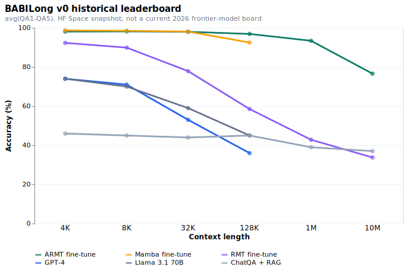
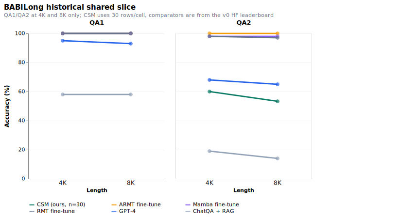
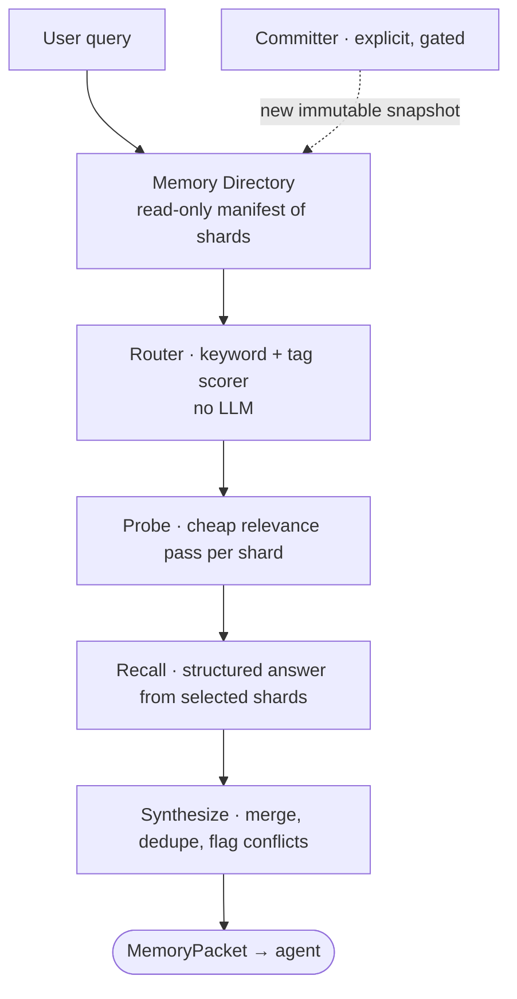
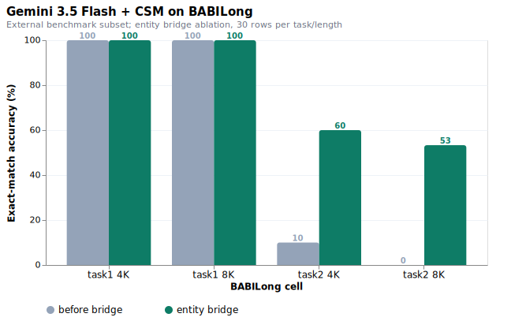

# Context Swarm Memory (CSM)


<p align="center">
  
</p>

**A memory whose edge *grows* as it scales — instead of degrading.**

CSM is an R&D memory system where bounded LLM-context **memory shards** act as read-only witnesses. A Memory Manager routes a query to candidate shards, probes them cheaply, recalls from only the useful ones, and synthesizes a compact, **cited** answer. Durable memory changes only through an explicit Committer protocol. It is an alternative to / complement of classic RAG, built for narrative, evolving project memory.

---

## The headline

Conventional memory degrades as it fills up — more history means more to sift, and retrieval/context quality falls off. **CSM is built so it doesn't.** Scaling the corpus 10× (100K → 1M tokens) at a fixed 8K-token window, CSM is the only system that keeps its accuracy, while vanilla RAG degrades and brute-force long-context collapses.

<p align="center">93%), vanilla RAG degrades (97->83%), long-context stays collapsed (37->30%)"></p>

At 1M tokens, CSM **overtakes vanilla RAG** (they were tied at 100K) and beats long-context **28–9, exact McNemar p<0.0001** — at **zero LLM-indexing cost** (keyword/tag routing plus a local embedding recall floor, no LLM-generated index), where long-context physically can't fit the corpus (8K = 0.06% of 1M) and embedding-RAG degrades under the added distractors. *The more CSM remembers, the more its edge shows.*

> Honest calibration: single-trial; CSM's absolute accuracy is ~27–30/30 across runs (Gemma at temp=0 is not bitwise-deterministic across processes), so the robust claim is **"does not degrade as memory grows, while the alternatives do"** — not that its raw score climbs.

## Results — current evidence status

Same 30-query benchmark, same 100K-token corpus, same local Gemma 4 31B answering for **every** system (8K context, temp 0) — only the retrieval/memory layer differs. CSM beats **LightRAG**, a 2025 graph-RAG comparator, on accuracy (paired exact McNemar **p=0.031**) and leads clearly on **citation grounding quality**:

<p align="center"></p>

- **vs LightRAG (2025 graph-RAG): CSM wins** — citation F1 0.505 vs 0.265, accuracy ≥27/30 vs 24/30 (p=0.031). Mem0 and HippoRAG could not be made to run locally on consumer hardware — documented as **blocked, not beaten** ([`SOTA_COMPARISON.md`](SOTA_COMPARISON.md)).
- **vs vanilla / hybrid RAG: accuracy is a statistical tie** (overlapping CIs; the lead flips run-to-run within nondeterministic noise). CSM's honest edge is *citation quality* + **zero-LLM indexing**, not an accuracy gap — we don't dress a near-tie as a rout.
- **The cost is latency:** CSM is ~3.5× slower than RAG per query (the probe → recall → synth → answer chain). Fine for offline project memory; the open problem for interactive use.

Full numbers, per-query breakdown, significance, and methodology: [`SOTA_COMPARISON.md`](SOTA_COMPARISON.md) · [`PHASE_30Q_RESULTS.md`](PHASE_30Q_RESULTS.md) · [`docs/BENCHMARK_METHODOLOGY.md`](docs/BENCHMARK_METHODOLOGY.md).

## BABILong external status

BABILong is useful external evidence, but its public Space leaderboard is a
historical v0 snapshot, not a fresh 2026 frontier-model board. It does not track
the current best models, so this repo must not use it as proof of 2026 SOTA. The
chart below is kept only to show the old published bar on avg(QA1-QA5).

<p align="center"></p>

On the exact slice CSM has run so far - QA1/QA2 at 4K and 8K - the honest result
is: **CSM is promising, but not BABILong SOTA, and not 2026 SOTA evidence.** It
ties the historical top systems on QA1, but QA2 still trails ARMT/Mamba/RMT and
GPT-4. It does beat the historical ChatQA + RAG line on QA2, which is useful
evidence that the shard-memory route is not just a toy RAG wrapper.

<p align="center"></p>

| BABILong shared slice | CSM | ARMT fine-tune | Mamba fine-tune | RMT fine-tune | GPT-4 | ChatQA + RAG |
|---|---:|---:|---:|---:|---:|---:|
| QA1 / 4K | 100.0 | 100.0 | 100.0 | 100.0 | 95.0 | 58.0 |
| QA1 / 8K | 100.0 | 100.0 | 100.0 | 100.0 | 93.0 | 58.0 |
| QA2 / 4K | 60.0 | 100.0 | 98.0 | 98.0 | 68.0 | 19.0 |
| QA2 / 8K | 53.3 | 100.0 | 98.0 | 97.0 | 65.0 | 14.0 |

The next scientific milestone is therefore concrete: move the SOTA headline to
**Agent Memory Benchmark / BEAM** for memory-at-scale, then **Microsoft
STATE-Bench Memory Track** for agentic task improvement. BABILong stays as a
diagnostic long-context check unless fresh frontier-model rows are added. The
named product north star is **Hindsight**: CSM needs paired AMB/BEAM rows against
Hindsight before making any serious SOTA memory claim. The
freshness gate is documented in
[`docs/BENCHMARK_FRESHNESS.md`](docs/BENCHMARK_FRESHNESS.md), and the selected
benchmark ladder is tracked in
[`docs/SOTA_BENCHMARK_PLAN.md`](docs/SOTA_BENCHMARK_PLAN.md).

## How it works



- **The read path is branch-and-discard.** `ask()` never mutates durable memory — it only appends a query-run log. Enforced by `tests/mutationSafety.test.ts` with SHA-256 file hashes.
- **Writes are Committer-gated.** Durable memory changes only via `appendEventAndSnapshot` (user `remember`) or `applyCommitDecision` (Committer). Snapshots are immutable and versioned; the storage layer refuses overwrites.
- **Indexing is LLM-free.** Routing starts with a keyword/tag scorer, starved packets use a local `all-MiniLM-L6-v2` embedding recall floor, and retrieved shards get shard-local semantic expansion so sibling evidence can recover before filler swamps recall. No LLM-generated index is built; embedding vectors are disk-cached.

## Training direction

CSM is an inference-time memory layer today, not a model-training method. But the
same traces can become useful lower-level training data for models that need
better memory behavior:

- router traces teach **what to look at** before spending context
- probe accept/reject traces teach **which memories are relevant**
- recall packets and cited answers teach **grounded compression**
- Committer decisions teach **when memory should change, and when it must not**

The long-term research direction is to distill those traces into smaller memory
controllers, retrieval heads, adapters, or reinforcement-learning policies so a
model learns memory discipline closer to the runtime/weights boundary. That
would not make the model magically store everything in weights; it would teach
the model to use external memory with sharper routing, citations, and explicit
write boundaries while using less raw context.

## Tech stack

CSM is intentionally small and inspectable. The core system is TypeScript, local-file backed, and provider-agnostic.

| Layer | What CSM uses |
|---|---|
| Runtime | Node.js 20+, TypeScript, ES modules / NodeNext |
| CLI | `src/cli/index.ts`, run through `tsx` in development and compiled with `tsc` |
| Storage | Local JSON / JSONL under `data/`: directory, chronicle, immutable shard snapshots, query-run logs |
| Validation | Zod schemas for structured LLM JSON outputs and storage-facing data contracts |
| LLM provider seam | `LlmProvider` interface with `MockProvider` default; Gemini, OpenAI-compatible, Ollama, llama.cpp `llama-server`, OpenAI, and Anthropic wiring live behind the same seam |
| Embeddings | `@huggingface/transformers` with `Xenova/all-MiniLM-L6-v2` for local RAG / hybrid-RAG embedding baselines |
| Benchmark harness | Programmatic MCQ/free-form scoring, citation precision/recall/F1, bootstrap CIs, exact paired McNemar tests |
| SOTA sidecars | Python FastAPI sidecars for LightRAG, Mem0, and HippoRAG integration experiments |
| Site/docs | Static GitHub Pages site in `docs/`, generated charts as checked-in SVG assets |
| CI | GitHub Actions on Node 20 and 22: install, type-check, test, build, mock smoke benchmark |

## Testing and evidence

The trust model is simple: invariants are tested in code, benchmark scoring is programmatic, and the README claims point to reproducible artifacts.

| Check | What it proves | Runs Gemma? |
|---|---|---|
| `npm test` | 216 Vitest tests covering storage immutability, Committer-only writes, mutation safety, provider parsing, router/probe/recall behavior, scoring, cache contracts, sidecar proxy wiring, and baseline accounting | No |
| `npm run lint` | Full TypeScript type-check across `src/` | No |
| `npm run build` | The CLI and library code compile from source | No |
| `npm run bench:smoke` | Fresh-clone benchmark plumbing works against the real synthetic corpus with deterministic `MockProvider` | No |
| `npm run bench:sota:headline` | Regenerates the committed comparator table from saved result rows | No |
| `npm run bench:sota:scaling` | Reports whether systems improve, stay stable, or degrade as corpus size grows | No |
| `npm run bench:babilong:fetch` | Fetches the public BABILong external benchmark subset as JSONL | Yes |
| `npm run bench:babilong:csm` | Runs CSM row-wise on BABILong with exact-match free-form scoring | Yes |
| `npm run bench:report -- <runId>` | Benchmark summaries can be turned into report/plot artifacts | No |
| `npm run bench:trials -- <runId>` | Multi-trial runs can be summarized as mean +/- sample standard deviation | No |
| `npm run verify:published` | Hashes the committed evidence rows and recomputes the published headline counts, citation F1, and McNemar checks from `results.jsonl` | No |
| `npx tsx scripts/verify-corpus.ts` | The shipped PaySwift corpus loads, totals ~9M tokens, and preserves the core/filler structure | No |
| `npx tsx scripts/verify-no-leakage.ts` | Filler events do not leak banned answer-bearing terms from the hand-authored core facts | No |
| `npm audit` | Current package lock has no reported npm vulnerabilities | No |

What was used for the headline benchmark claims:

- **Answering model:** Gemma 4 31B Q4_K_M via local Ollama, 8K context, temperature 0, seed 42. CSM uses the smaller `gemma4:e4b` for probe calls and `gemma4:31b` for recall/synthesis/answering; the comparison systems use the same `gemma4:31b` answering model.
- **Hardware:** one RTX 4090-class local machine. Latency numbers are hardware-specific; accuracy/citation scoring is replayable from saved result artifacts.
- **Corpus:** PaySwift synthetic project-memory corpus, 22,363 events / ~9.0M tokens, released CC0 under `data/eval/corpus-synthetic/`.
- **Questions:** 30 multiple-choice queries with 40 options each and gold citation event IDs. Scoring is exact option match plus citation precision/recall/F1. No LLM judge is used.
- **Systems compared:** CSM, long-context, vanilla RAG, hybrid RAG, and LightRAG. Mem0 and HippoRAG are documented as locally blocked, not claimed as beaten. The next SOTA targets are tracked in `docs/SOTA_BENCHMARK_PLAN.md`.
- **Statistics:** bootstrap 95% confidence intervals, paired exact McNemar tests over the same query set, and scaling-slope reports for accuracy and citation precision/recall/F1.
- **Replay:** source, corpus, harness, and the small canonical v0.2 result rows are in git. `data/eval/runs/` still ignores ad-hoc local runs, caches, embeddings, and sidecar indexes.

Hosted cross-model check, kept separate from the Gemma headline:

- **Run:** `data/eval/runs/gemini35-160k-30q-v1/`
- **Model:** Gemini 3.5 Flash, temperature 0, `CSM_GEMINI_THINKING=low`
- **Setup:** same 30 questions over 100K, 1M, and 2M corpus sizes, with native model context capped at 160K tokens
- **2M result:** CSM 28/30 at ~18K mean input tokens; hybrid RAG 27/30; vanilla RAG 26/30; long-context 15/30 at ~170K mean input tokens. The run completed 360/360 cells with zero provider errors.

| Gemini 3.5 Flash system | 100K | 1M | 2M | 2M citation P/R/F1 | 2M mean input |
|---|---:|---:|---:|---:|---:|
| CSM | 28/30 | 29/30 | 28/30 | 0.789 / 0.446 / 0.515 | 18.1K |
| hybrid RAG | 27/30 | 27/30 | 27/30 | 0.677 / 0.364 / 0.386 | 5.6K |
| vanilla RAG | 28/30 | 26/30 | 26/30 | 0.600 / 0.315 / 0.334 | 5.4K |
| long-context | 30/30 | 27/30 | 15/30 | 0.211 / 0.122 / 0.086 | 170.5K |

Internal cross-model note: these Gemini rows are retained as an API-model
sanity check, not as the SOTA comparison. A real 2026 SOTA claim needs current
frontier-model rows on the same benchmark, not the historical BABILong v0 board.

BABILong CSM ablation, also Gemini 3.5 Flash:

- **Runs:** `babilong-csm-gemini35-4k8k-t1t2-30q-v1/` and `babilong-csm-gemini35-4k8k-t1t2-30q-v2-entitybridge/`
- **Benchmark:** BABILong public subset, tasks 1-2, lengths 4K and 8K, 30 rows per cell
- **Result:** CSM is 30/30 on task1 at both lengths; the entity bridge moves task2 from 3/30 to 18/30 at 4K and from 0/30 to 16/30 at 8K.

<p align="center"></p>

## Quickstart

```bash
npm install
npm test                       # 216 tests, no API keys (deterministic MockProvider)

npm run csm -- init
npm run csm -- shard create --name "Project X" --tags x,architecture
npm run csm -- remember --shard <shardId> --text "Decision: ..." --tags ...
npm run csm -- ask "What did we decide about X?"
```

The default provider is a deterministic MockProvider (no network). To run the real local benchmark on Ollama + Gemma 4 (RTX 4090, zero API cost), see [`docs/REPRODUCING.md`](docs/REPRODUCING.md).

## Evaluation

- **Corpora:** PaySwift is a synthetic 22K-event / ~9M-token project log with 30 multiple-choice queries (40 options each) and gold source-event citations, released **CC0**. BABILong is now driven as a public external benchmark subset; see [`docs/BABILONG_RESULTS.md`](docs/BABILONG_RESULTS.md).
- **Baselines/comparators:** PaySwift uses long-context, vanilla RAG, hybrid RAG, CSM, and LightRAG. BABILong uses a historical Hugging Face leaderboard snapshot for diagnostic comparison on the overlapping QA1/QA2 4K/8K cells; it is not treated as current 2026 SOTA.
- **Scoring is programmatic:** exact-match accuracy + citation precision/recall/F1 + bootstrap 95% CIs + paired exact McNemar. The same answering model is used for every system, so only retrieval differs.
- **Reproducible + cached:** every (model, prompt) is content-hashed, so replaying a saved run costs zero LLM calls (`npm run bench:replay -- <runId>`). The corpus, harness, canonical published result rows, and BABILong leaderboard snapshot are in git; larger local caches and sidecar indexes stay ignored. Charts regenerate from committed summaries via `npm run charts:readme`.

## Limitations

- **Single-trial + measured nondeterminism.** The public bundle includes single-trial Gemma and Gemini 3.5 Flash evidence. CSM is ~27–30/30 across runs (temp=0 is not bitwise-deterministic across processes); `npm run bench:confirm` + `npm run bench:trials` are wired for a 3-trial confirmation, but those rows are not yet part of the public evidence bundle.
- **Latency.** CSM's pipeline is ~3.5× slower than RAG per query.
- **Scope.** The README headline numbers are Gemma 4 31B Q4_K_M on one RTX 4090; Gemini 3.5 Flash rows are cross-model confirmation evidence and are labeled separately.

## Documentation

| Doc | What |
|---|---|
| [`SOTA_COMPARISON.md`](SOTA_COMPARISON.md) | CSM vs 2025 graph-RAG comparator — LightRAG head-to-head, Mem0/HippoRAG findings, McNemar significance, integration audit |
| [`PHASE_30Q_RESULTS.md`](PHASE_30Q_RESULTS.md) | Full results — per-query breakdown, scaling table, embedding-floor analysis |
| [`docs/ARCHITECTURE.md`](docs/ARCHITECTURE.md) | 5-minute architecture overview |
| [`docs/BENCHMARK_METHODOLOGY.md`](docs/BENCHMARK_METHODOLOGY.md) | Authoritative methodology + threats to validity |
| [`docs/BENCHMARK_FRESHNESS.md`](docs/BENCHMARK_FRESHNESS.md) | 2026 freshness gate for any future SOTA claim |
| [`docs/SOTA_BENCHMARK_PLAN.md`](docs/SOTA_BENCHMARK_PLAN.md) | Current SOTA ladder, benchmark axes, go/no-go rules, and next integrations |
| [`integrations/amb/README.md`](integrations/amb/README.md) | Agent Memory Benchmark / BEAM bridge for running CSM as an AMB memory provider |
| [`docs/EVIDENCE.md`](docs/EVIDENCE.md) | Claim-to-artifact map, hashes, verifier command, and remaining proof limits |
| [`docs/GEMINI.md`](docs/GEMINI.md) | Hosted Gemini provider setup and cross-model confirmation workflow |
| [`docs/REPRODUCING.md`](docs/REPRODUCING.md) | Step-by-step reproduction on a local 4090 |
| [`docs/REPLICATION_KIT.md`](docs/REPLICATION_KIT.md) | Third-party replication commands and report template |
| [`docs/SCIENTIFIC_RELEASE.md`](docs/SCIENTIFIC_RELEASE.md) | DOI/archive, release, sidecar, and 3-trial checklist |
| [`docs/COST_ACCOUNTING.md`](docs/COST_ACCOUNTING.md) | Token/latency cost model |
| [`specs/`](specs/) | Full design spec, benchmark + release plan, corpus design |
| [`CONTRIBUTING.md`](CONTRIBUTING.md) · [`CHANGELOG.md`](CHANGELOG.md) | Contributor guide · release notes |

## License

This project is open source under the **MIT License** ([`LICENSE`](LICENSE)). You may use, copy, modify, merge, publish, distribute, sublicense, and sell copies of the software under the license terms. The synthetic benchmark corpus under `data/eval/corpus-synthetic/` is original work released under **CC0**.

Author/contact: Mohamad Jawdat Alakoum ([LinkedIn](https://www.linkedin.com/in/akoum/)).
