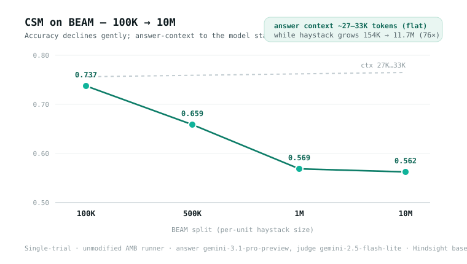
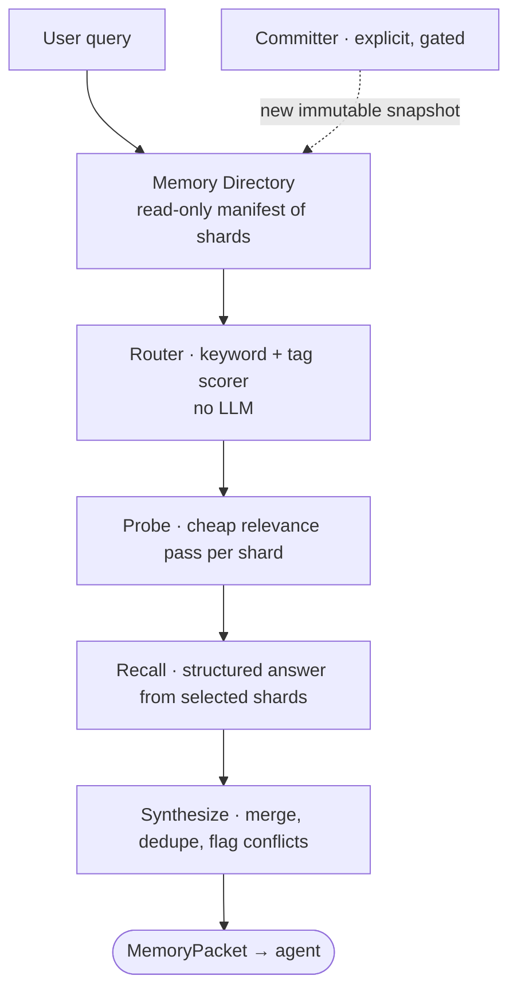

<p align="center">
  <a href="https://muhamadjawdatsalemalakoum.github.io/context-swarm-memory/">
    
  </a>
</p>

<h1 align="center">Context Swarm Memory (CSM)</h1>

<p align="center">
  
  
  
  
  <a href="https://muhamadjawdatsalemalakoum.github.io/context-swarm-memory/"></a>
</p>

<p align="center"><strong>Cited, auditable LLM agent memory whose retrieval cost stays flat as memory grows.</strong></p>

<p align="center">
  <a href="https://muhamadjawdatsalemalakoum.github.io/context-swarm-memory/">
    
  </a>
</p>

CSM is an R&D memory system for LLM agents. Memory is a swarm of **bounded,
immutable, read-only shards**. A Memory Manager routes a query to candidate
shards (zero-LLM keyword/tag scoring), probes them cheaply, recalls only from
the useful ones, and synthesizes a compact answer cited down to **shard,
snapshot, and event IDs**. Querying memory never mutates it; durable memory
changes only through an explicit Committer protocol. It's an alternative to /
complement of classic RAG, built for narrative, evolving project memory.

The point of the design: **CSM's total retrieval cost per query stays bounded
no matter how large the underlying memory gets** — ~36–38K input tokens all-in
(what the answer model sees, plus CSM's own probe/recall/synthesize calls),
flat as history grows. Cost doesn't balloon with memory.

---

## Headline result — the BEAM scaling ladder

Run through the **unmodified public Agent Memory Benchmark (AMB) runner** at
every BEAM split from 100K to 10M tokens (their CLI, their scoring, their judge
path; a 3-file CSM provider and nothing else). Answer model
`gemini-3.1-pro-preview`, judge `gemini-2.5-flash-lite` — the same path as the
accepted Hindsight artifact. Frozen CSM pipeline, single-trial, 2,000 graded
queries.

<p align="center"></p>

| BEAM tier | CSM score | Hindsight score | CSM answer-ctx | Hindsight answer-ctx | CSM all-in input¹ |
|---|---:|---:|---:|---:|---:|
| 100K | **0.7367** | 0.7337 | 27.0K | 17.7K | **35.8K** |
| 500K | 0.6589 | **0.7112** | 26.6K | 20.5K | **36.2K** |
| 1M | 0.5693 | **0.7386** | 28.2K | 23.9K | **38.1K** |
| 10M | 0.5616 | **0.6408** | 32.5K | 27.3K | **35.9K** |

<sup>¹ CSM all-in input = answer-visible context **plus** CSM's own
probe/recall/synthesize tokens — the honest per-query total. Hindsight
discloses no internal-pipeline cost and synthesizes memory at ingest, so it has
no comparable all-in figure; its column is answer-context only.</sup>

Read straight, three things:

1. **Total cost stays flat across a 100× range.** CSM's *all-in* input — what
   the answer model sees **plus** CSM's own probe/recall/synthesize calls — is
   **~36–38K tokens per query** whether the per-unit haystack is 154K (100K) or
   **11.7M** (10M). Retrieval cost does not scale with corpus size. The
   answer-visible slice alone is ~26–33K; the internal pipeline adds ~3–10K
   (≈25% of the token count, but on models ~10× cheaper, so ~7% of dollars).
   Apples-to-apples on the answer context Hindsight is leaner (17.7–27.3K vs our
   26–33K); on *total* cost Hindsight reports no internal figure and distills
   memory at ingest, so its all-in is unstated — CSM's accounting is the
   complete one.
2. **CSM trails Hindsight above 100K — stated plainly.** CSM edges Hindsight at
   100K (0.7367 vs 0.7337, within single-trial noise); Hindsight leads at
   500K/1M/10M, most at 1M (+0.17).
3. **But CSM degrades gracefully and stabilizes at the extreme, while Hindsight
   drops.** From 1M→10M CSM is essentially flat (−0.008; it *improves* in 7 of
   10 categories) while Hindsight takes its single biggest drop (−0.098,
   declining in 9 of 10) — so the gap **more than halves, +0.169 → +0.079.** At
   the hardest tier (one ~11.7M-token document) CSM's bounded-retrieval design
   holds where Hindsight's begins to slip. Both collapse on
   `multi_session_reasoning` at 10M (0.12 vs 0.17) — the shared unsolved frontier.

Honest caveats: single-trial on both sides; 10M is 200 queries (higher
variance); **CSM still trails Hindsight at every tier above 100K**; two points
don't prove the trend continues — *"does CSM overtake beyond 10M?"* is the open
question, not a settled win. (The 100K artifact submitted as
[PR&nbsp;#19](https://github.com/vectorize-io/agent-memory-benchmark/pull/19),
pending acceptance, scored 0.743110; the ladder reproduces 100K at 0.7367.)

Hindsight's numbers are recomputed from Vectorize's own committed AMB artifacts
(`outputs/beam/hindsight/single-query/*.json.gz`), same answer/judge models —
re-verify with `node scripts/verify-hindsight-ladder.mjs`. Full per-category
analysis and sources:
[`docs/AMB_BEAM_LADDER_2026_06_18.md`](docs/AMB_BEAM_LADDER_2026_06_18.md).

## How it works


```mermaid
flowchart TD
    Q[User query] --> D[Memory Directory<br/>read-only manifest of shards]
    D --> R[Router · keyword + tag scorer<br/>no LLM]
    R --> P[Probe · cheap relevance pass per shard]
    P --> RC[Recall · structured answer from selected shards]
    RC --> S[Synthesize · merge, dedupe, flag conflicts]
    S --> MP([MemoryPacket → agent])
    C[Committer · explicit, gated] -. new immutable snapshot .-> D
```

- **Read path is branch-and-discard.** `ask()` never mutates durable memory — it only appends a query-run log. Enforced by `tests/mutationSafety.test.ts` with SHA-256 file hashes.
- **Writes are Committer-gated.** Durable memory changes only via `appendEventAndSnapshot` (user `remember`) or `applyCommitDecision` (Committer). Snapshots are immutable and versioned; the storage layer refuses overwrites.
- **Indexing is LLM-free.** Keyword/tag routing plus a local `all-MiniLM-L6-v2` embedding recall floor; no LLM-generated index is ever built, so adding memory costs no API tokens.
- **Coverage queries get a deterministic chronicle.** Summary/ordering/temporal queries attach a date-ordered, fully-cited timeline to the MemoryPacket, assembled with no extra LLM calls. Date arithmetic is computed, never delegated to the model.

Design and data types: [`docs/ARCHITECTURE.md`](docs/ARCHITECTURE.md) · [`specs/`](specs/).

## Honest limitations

- **Single-trial.** Each BEAM tier is one run; Gemini at temperature 0 is not
  bitwise-deterministic (100K reproduced at 0.7367 here vs 0.743110 in the
  submitted rerun — ~±0.01 variance).
- **Accuracy declines with BEAM scale**, concentrated in multi-hop categories;
  `multi_session_reasoning` at 10M (0.12) is the clearest gap. The flat-cost
  property is the durable claim, not absolute accuracy at extreme scale.
- **No *official-runner* Hindsight comparison beyond 100K.** The 500K/1M/10M
  Hindsight numbers are recomputed from Vectorize's own committed AMB artifacts,
  not a fresh official run; and CSM has no "official" status until the
  maintainers accept the provider/result.
- **Multi-call by design — costs latency and internal tokens.** CSM runs
  probe → recall → synthesize rather than one retrieval call. The June 2026
  rebuild cut average BEAM retrieval ~8× (29.2s → 3.47s at 100K) but it remains
  heavier than single-call retrieval, and trends heavier at the deepest tiers
  (non-monotonic: 4.5/7.5/5.6/11.9s, peaking at 10M). It also spends ~3–10K
  internal input tokens/query on top of the answer context — counted in the
  all-in ~36–38K above, on models ~10× cheaper. Hindsight's single-call design
  carries less of this tax (though it pays an undisclosed ingest-time distillation cost).
- **Mem0 and HippoRAG are documented as blocked on local hardware, not beaten.**

## Quickstart

```bash
npm install
npm test                       # 333 tests, no API keys (deterministic MockProvider)

npm run csm -- init
npm run csm -- shard create --name "Project X" --tags x,architecture
npm run csm -- remember --shard <shardId> --text "Decision: ..." --tags ...
npm run csm -- ask "What did we decide about X?"
```

The default provider is a deterministic MockProvider (no network). Hosted Gemini
setup: [`docs/GEMINI.md`](docs/GEMINI.md). Local Gemma-on-4090 reproduction:
[`docs/REPRODUCING.md`](docs/REPRODUCING.md).

## Verify the claims

Don't trust the README — recompute it:

```bash
npm test                  # 333 offline tests (MockProvider, no keys)
npm run verify:published  # re-hash committed artifacts + recompute every headline number
```

`verify:published` recomputes the BEAM ladder (all four tiers), the submitted
100K rerun, citation F1, and McNemar checks directly from the saved rows, and
checks the LF-normalized SHA-256 of each artifact. Raw AMB outputs are large and
gitignored, so it verifies them when present and prints an explicit SKIP
otherwise.

## Tech stack

TypeScript (Node 22+, ES modules), local JSON/JSONL storage, `zod` validation,
`vitest`. Provider seam: `MockProvider` default; Gemini (active hosted
provider), OpenAI-compatible, Ollama, llama.cpp, Anthropic. Embeddings via
`@huggingface/transformers` (`all-MiniLM-L6-v2`). Static GitHub Pages site in
`docs/`. CI on Node 22: install, type-check, test, build, published-evidence
verification.

## Documentation

| Doc | What |
|---|---|
| [`docs/AMB_BEAM_LADDER_2026_06_18.md`](docs/AMB_BEAM_LADDER_2026_06_18.md) | The full BEAM scaling ladder (100K→10M): per-category table, findings, artifact hashes |
| [`docs/AMB_BEAM_100K_OFFICIAL_RERUN.md`](docs/AMB_BEAM_100K_OFFICIAL_RERUN.md) | BEAM 100K vs Hindsight via the official runner — submitted as PR #19 |
| [`docs/ARCHITECTURE.md`](docs/ARCHITECTURE.md) | Architecture overview |
| [`docs/EVIDENCE.md`](docs/EVIDENCE.md) | Claim-to-artifact map, hashes, verifier command |
| [`docs/BENCHMARK_METHODOLOGY.md`](docs/BENCHMARK_METHODOLOGY.md) | Methodology + threats to validity |
| [`docs/PERF_BREAKDOWN.md`](docs/PERF_BREAKDOWN.md) | Latency rebuild ledger (29.2s → 3.47s) |
| [`docs/RD_PORTFOLIO_2026_06.md`](docs/RD_PORTFOLIO_2026_06.md) | June 2026 R&D wave (incl. falsified hypotheses) |
| [`SOTA_COMPARISON.md`](SOTA_COMPARISON.md) · [`PHASE_30Q_RESULTS.md`](PHASE_30Q_RESULTS.md) | Synthetic-corpus comparison + full per-query results |
| [`integrations/amb/README.md`](integrations/amb/README.md) | Running CSM as an AMB / BEAM memory provider |
| [`docs/REPRODUCING.md`](docs/REPRODUCING.md) · [`docs/REPLICATION_KIT.md`](docs/REPLICATION_KIT.md) | Reproduction + third-party replication |

## License

Open source under the **MIT License** ([`LICENSE`](LICENSE)). The synthetic
benchmark corpus under `data/eval/corpus-synthetic/` is original work released
under **CC0**.

Author: **Muhamad J. Akoum** ([LinkedIn](https://www.linkedin.com/in/akoum/)).
