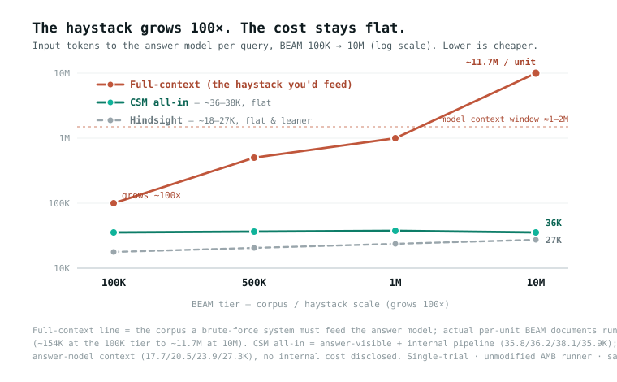
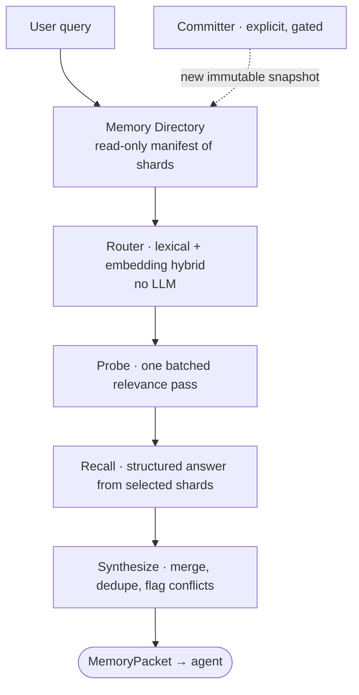

<p align="center">
  <a href="https://muhamadjawdatsalemalakoum.github.io/context-swarm-memory/">
    
  </a>
</p>

<h1 align="center">Context Swarm Memory (CSM)</h1>

<p align="center">
  
  
  
  
  <a href="https://muhamadjawdatsalemalakoum.github.io/context-swarm-memory/"></a>
</p>

<p align="center"><strong>Cited, auditable LLM agent memory whose <em>per-query</em> retrieval cost stays flat as memory grows.</strong></p>

<p align="center">
  <a href="https://muhamadjawdatsalemalakoum.github.io/context-swarm-memory/">
    
  </a>
</p>

CSM is an R&D memory system for LLM agents. Memory is a swarm of **bounded,
immutable, read-only shards**. A Memory Manager routes a query to candidate
shards, probes them cheaply, recalls only from the useful ones, and synthesizes
a compact answer cited down to **shard, snapshot, and event IDs**. Querying
memory never mutates it; durable memory changes only through an explicit
Committer protocol.

Two claims carry the project, and they are different kinds of claim:

1. **Retrieval cost per query is bounded by construction.** CSM's total
   per-query input — the packet the answer model sees *plus* CSM's own
   probe/recall/synthesize calls — stays at **~36–38K tokens** as the per-unit
   haystack grows **76×**, from ~154K to ~11.7M tokens. This is a property of
   the architecture, not a win over anyone — and it is a claim about *query*
   cost specifically. CSM's current default config also does write-time fact
   extraction, whose ingest cost is **not** flat; see
   [The cost claim, stated precisely](#the-cost-claim-stated-precisely).
2. **Accuracy is a live, partly-unsettled question.** CSM has **certified
   category-level leads** over the strongest published competitor on a
   calibrated instrument — and it has a longer list of levers that were
   measured, failed, and got published anyway. Both are below.

> **Status, plainly (2026-08-30).** CSM has **no official leaderboard
> placement** and has never had one. The upstream submission
> ([PR&nbsp;#19](https://github.com/vectorize-io/agent-memory-benchmark/pull/19))
> was **author-closed on 2026-06-22, unmerged**. The June 2026 ladder below is
> preserved as an honest historical record, but it is **twice stale** — it
> measured a CSM configuration that no longer exists, and the upstream runner
> has since changed in ways that make pre-change scores non-comparable. The
> re-run that would settle it is staged and blocked; see
> [Where this actually stands](#where-this-actually-stands).

---

## The flat-cost result (June 2026, official AMB runner)

Run through the **public Agent Memory Benchmark (AMB) runner** at every BEAM
split from 100K to 10M tokens — their CLI, their scoring, their judge path. CSM enters through `npm run amb:patch`, which copies one provider file into the upstream checkout and makes two upstream edits: it registers the provider in `memory/__init__.py`, and it adds a configurable HTTP timeout (`OMB_GEMINI_TIMEOUT_MS`) to `llm/gemini.py`. Neither edit touches scoring, judging or retrieval logic, but "a 3-file provider and nothing else" — the earlier wording — was not accurate. Answer model
`gemini-3.1-pro-preview`, judge `gemini-2.5-flash-lite`, matching the Hindsight
artifact. Frozen pipeline, single-trial, 2,000 graded queries.

<p align="center"></p>

<p align="center"><em>As the per-unit haystack grows 76× (~154K → ~11.7M tokens), full-context input explodes past the model's context window while CSM (~36–38K all-in) and Hindsight (~18–27K, leaner) stay flat. <strong>Per-query retrieval</strong> cost does not scale with the corpus — ingest cost does; see below.</em></p>

| BEAM tier | CSM score | Hindsight score | CSM answer-ctx | Hindsight answer-ctx | CSM all-in input¹ |
|---|---:|---:|---:|---:|---:|
| 100K | **0.7367** | 0.7337 | 27.0K | 17.7K | **35.8K** |
| 500K | 0.6589 | **0.7112** | 26.6K | 20.5K | **36.2K** |
| 1M | 0.5693 | **0.7386** | 28.2K | 23.9K | **38.1K** |
| 10M | 0.5616 | **0.6408** | 32.5K | 27.3K | **35.9K** |

<sup>¹ CSM all-in input = answer-visible context **plus** CSM's own
probe/recall/synthesize tokens — the per-query total. Hindsight's column is
answer-context only; it discloses no internal-pipeline figure. On the
apples-to-apples answer slice **Hindsight is leaner**. Neither column includes
either system's ingest-time cost.</sup>

**What survives from this run:** the flat *per-query retrieval* cost. All-in
input is ~36–38K per query whether the per-unit haystack is 154K or 11.7M
tokens. The internal pipeline is ~25% of the token *count* at 100K–1M
(8.8–9.9K of 36–38K) and ~9% at 10M (3.4K of 35.9K, where one giant shard means
one probe and one recall), and it runs on models ~10× cheaper — so single-digit
percent of the dollars.

**What does not survive:** the scores, as a statement about CSM today. And the
cost figure needs one correction of its own, because the configuration that
produced it had no write-time stage — see below.

## The cost claim, stated precisely

The flat-cost headline is real but it is a claim about **query** cost, and it
was measured on a configuration with **no write-time stage**. Today's default
config turns the fact fold on, and that changes the accounting in a way worth
stating plainly rather than burying.

**Per query, retrieval cost is flat.** ~36–38K all-in input across a 76×
haystack range (average per-unit 154,431 → 11,707,222 tokens; census-sourced). The fold does not change this — measured token-neutral at
answer time (7,106 → 7,080 on abstention; 7,010 → 7,074 on knowledge_update).

**At ingest, cost is not flat — it is O(corpus).** The fact registry chunks each
unit at 100K tokens and reads *every* chunk, so a first ingest reads the entire
corpus once:

| tier | per-unit haystack (avg) | units | first-ingest input | queries | amortized/query |
|---|---:|---:|---:|---:|---:|
| 100K | 154,431 | 20 | 3,088,625 | 400 | ~7.7K |
| 500K | 560,086 | 35 | 19,602,995 | 700 | ~28K |
| 1M | 1,155,117 | 35 | 40,429,107 | 700 | **~58K** |
| 10M | 11,707,222 | 10 | 117,072,219 | 200 | **~585K** |

Figures are from `data/eval/corpus-beam-slice/census.json` (the benchmark's own
corpus census), not estimated. At **1M the one-time build (~58K/query) exceeds
the per-query retrieval cost (~38K)**; at **10M (~585K/query) it is ~16× larger**
— the pre-flight budgets that tier as most of a $750–960 estimate.

**Three things keep this honest rather than fatal:**

1. It is **one-time and disk-cached** (keyed `split|user|model|promptVersion`);
   re-runs pay nothing.
2. It runs on the **cheap model tier**, like the internal pipeline.
3. In a real deployment memory arrives incrementally, so facts are extracted
   per turn as it lands. The whole-corpus read is a **backfill**, not a
   recurring cost. This is the honest defense — and it is *precisely the same
   defense Hindsight has*, which is why this repo no longer claims its own
   accounting is "the complete one" by comparison. It isn't. Both systems now
   distill at ingest; CSM's ingest cost is disclosed above, Hindsight's is not,
   and that is the only difference worth stating.

**And the ~36–38K figure is measured for the June config, projected for
today's.** The batched probe cuts internal input ~21%, which would put today's
number nearer ~34–36K, but that has not been measured on the official path.
Treat it as an estimate until the re-run lands.

## Where this actually stands

The June ladder is stale in two independent ways, and both matter.

**1. It measures a CSM that no longer exists.** It ran 2026-06-18, before every
lever that has since been certified and turned on:

| lever | default | why it is on |
|---|---|---|
| hybrid router + descriptors | **ON** | +0.365 answer at 1M, 26W/5L — the strongest single effect measured on this project. **Caveat:** measured on sidecar arm r1mC (2026-07-31) *before* the render-gap fix, on a harness that dropped the evidence capsule from *both* arms; the delta is within-harness valid but the absolutes are not, and it has not been re-measured with the capsule rendered. Every post-fix certified result runs with it ON — indirect support, not a re-measurement |
| ID repair | **ON** | ~0.20 |
| batched probe (hosted only) | **ON** | −21% internal input (arithmetic: one shared scaffold replaces 8), score delta +0.032 — below its 0.079 MDE, i.e. neutral. Local providers stay OFF. |
| fact fold (write-time fact registry) | **ON** | 500K `knowledge_update` **certified on two independent readers** (+0.382 / +0.326); 1M paired +0.114 with CI above zero; token-neutral at answer time |
| preference profile | OFF | composed with the fold it measured **−0.036** (4W/9L) versus the fold alone |
| coverage mode + chronicle (`CSM_COVERAGE`) | **ON** | deterministic cited timeline for summary/ordering/temporal queries; default since 2026-06-10 |
| embedding recall floor (`CSM_EMBED_FLOOR_K=10`) | **ON** | bridge path: a local-embedding top-K of raw turns is unioned into the return set when CSM's packet is starved. On every certified query |
| shard expansion (`CSM_SHARD_EXPAND_K=3` / `_MAX=16`) | **ON** | bridge path: neighbouring turns of a hit are pulled in. On every certified query |
| entity bridge (`CSM_ENTITY_BRIDGE_K=6` / `_MAX=24`) | **ON** | bridge path: same-shard turns sharing the query's entity terms are pulled in. On every certified query; its hand-rolled cut now goes through `select()` |
| lean return, needle net, session digests, ordered capsule, local probe gate, probe shrink, coverage reranker (`CSM_AMB_COVERAGE_RERANK` — the one that gained +11.6 proxy and lost answers), cross-encoder reranker (`CSM_HYBRID_RERANK` — a different, unrelated lever), virtual shards, legacy vocab/intent | **OFF** | each measured negative, non-replicating, or a wash |

The gap between that config and the ladder's config is not cosmetic. On the
same 1M queries, re-measured at full category size:

| category @1M | June ladder | today's defaults |
|---|---:|---:|
| `event_ordering` | −0.216 | **−0.023** |
| `knowledge_update` | −0.435 | **−0.111** |
| `abstention` | +0.086 | **+0.193 (certified)** |

**2. The upstream runner changed, so old scores are not comparable to new
ones.** After upstream PR #20 the benchmark switched to a mem0-parity prompt, a
nugget judge, and temperature 0; `event_ordering` is no longer scored by
Kendall τ-b. Pre-change numbers — Hindsight's committed April artifacts *and*
this project's June ladder — cannot be set against a post-change run. Any
future submission is a **new PR against the post-#20 runner, with Hindsight
re-scored on the same pinned commit**.

The official re-run is fully staged (frozen config, eight pre-flight blockers
found and fixed, launch recipe) and blocked on two things outside the code:
API credit, and an upstream 10M loader fix. See
[`docs/PREFLIGHT_OFFICIAL_LADDER.md`](docs/PREFLIGHT_OFFICIAL_LADDER.md).

## The free instrument, and what it certified

Waiting on a blocked official run is not a measurement strategy, so the August
2026 campaign ran on a **free apples-to-apples instrument**
([`scripts/headtohead-arms.ts`](scripts/headtohead-arms.ts)): one answer model
and one judge serve **both** arms, the same queries and prompts,
and **the retrieved context is the only variable**. Hindsight's arm is replayed
from its own published BEAM contexts, so its system never has to be re-run.

The instrument was calibrated before it was trusted: holdout **ρ 0.864 /
MAE 0.077** against the official Gemini judge, and it reproduced the official
tie at 100K and loss at 1M.

Its discipline, which bounds every number below: a delta smaller than its
**minimum detectable effect (MDE)** is *not an effect*, and n=25 is a pointer,
not a verdict.

**Certified — clears MDE, CI excludes zero, replicated on a second independent reader:**

| tier | category | n | CSM | Hindsight | delta | MDE | W/L/T | second reader |
|---|---|---:|---:|---:|---:|---:|---|---|
| 500K | `knowledge_update` (fact fold) | 70 | 0.758 | 0.376 | **+0.382** | 0.173 | 37/6/27 | **+0.326** (n=67) |
| 1M | `abstention` | 70 | 0.679 | 0.486 | **+0.193** | 0.167 | 23/8/39 | **+0.185** (n=69) |

The second reader ran at a *smaller* n than the primary — 67 and 69 rather than
70 — because free-tier throttling exhausted retries on 7 and 1 pairs
respectively. Those pairs are excluded and reported as-is, never backfilled.

**Directional, full-n, replicated — but below MDE, so not claimed as leads:**
500K `contradiction_resolution` (+0.096, 38W/21L) and `preference_following`
(+0.075, 18W/10L).

**The goal was two certified categories at every tier. It was not met, and it
cannot be settled on this instrument.** n=70 is the *entire* category — there is
no more sample to draw. The MDE is set by the free reader/judge's per-query
variance, so a ~0.09 effect is unresolvable at maximum n. That is a
procurement blocker, not an engineering one.

## What was measured and failed

This list is the point, not an appendix. Every entry cost real money and is
published with the same weight as the wins.

- **The +0.068 "displacement" result — retracted.** The arm was graded on a
  context that could not be reproduced byte-for-byte: the capsule rendered as a
  placeholder string. Rule adopted: never grade an arm on a context you cannot
  re-render. Synthesized text is now persisted per run.
- **Coverage proxy is anti-correlated with answers.** A reranker gained +11.6
  on retrieval coverage and *lost* answers on `event_ordering` (4W/13L,
  p=0.049). Order-changing levers are now gated on the answer metric only.
- **Component gains do not survive assembly.** A router bench predicted **+0.24
  retrieval coverage**; wired into the real pipeline the same change delivered
  **−0.12 coverage** — retrieved evidence fell 55% because every downstream
  stage is calibrated in units of *shards*, not events. (Both numbers are
  coverage, not answer score; see the finding directly above for why those are
  not interchangeable.)
- **Levers do not transfer across tiers.** The needle net worked at 500K and
  did not replicate at 1M; lean-return K=16 regressed 500K
  `information_extraction`. Every default flip now requires cross-tier evidence.
- **Cheapening the witness fails; cheapening the question works.** A local
  pre-gate (L3) that skipped witnesses lost `knowledge_update` on a 3-point
  dose-response and was killed. Batching the probe question (L2b) keeps every
  witness at −21% input and shipped.
- **Gemini context caching — falsified.** A projected 40–60% cost cut died on a
  measured 4,096-token implicit-cache floor: every CSM call is sub-floor, so the
  pipeline gets exactly zero caching.
- **Mem0 and HippoRAG are blocked, not beaten.** They could not be run on the
  available hardware. That is documented as a gap, never as a win.

Full ledgers: [`docs/experiments/`](docs/experiments/).

## How it works


```mermaid
flowchart TD
    Q[User query] --> D[Memory Directory<br/>read-only manifest of shards]
    D --> R[Router · lexical + embedding hybrid<br/>no LLM]
    R --> P[Probe · one batched relevance pass]
    P --> RC[Recall · structured answer from selected shards]
    RC --> S[Synthesize · merge, dedupe, flag conflicts]
    S --> MP([MemoryPacket → agent])
    C[Committer · explicit, gated] -. new immutable snapshot .-> D
```

- **Read path is branch-and-discard.** `ask()` never mutates durable memory — it
  only appends a query-run log. Enforced by `tests/mutationSafety.test.ts` with
  SHA-256 file hashes.
- **Writes are Committer-gated.** Durable memory changes only via
  `appendEventAndSnapshot` (user `remember`) or `applyCommitDecision`.
  Snapshots are immutable and versioned; the storage layer refuses overwrites.
- **Indexing is LLM-free.** Routing is lexical in the CLI, and hybrid — lexical
  plus a local `all-MiniLM-L6-v2` embedding leg — on the benchmark bridge, which
  builds the embedding index at ingest. No LLM-generated index is ever built, so
  adding memory costs no API tokens. (The CLI does not yet wire the hybrid
  router; the +0.365 result is a bridge-path measurement.)
- **A component that cannot discriminate says so.** Ranking goes through
  `select()`, which reports degeneracy rather than returning a confident-looking
  arbitrary order.
- **Unrecognised configuration is an error, never a default.** Every `CSM_*`
  read goes through `src/utils/env.ts` and throws on a value it does not know —
  the fix for a silent `CSM_ROUTER_HYBRID=off` that once turned the router *on*.
- **Coverage queries get a deterministic chronicle.** Summary/ordering/temporal
  queries attach a date-ordered, fully-cited timeline assembled with no extra
  LLM calls. Date arithmetic is computed, never delegated to the model.
- **Write-time artifacts fold into the capsule when one exists.** The fact
  registry and preference profile are prepended *into* the evidence capsule
  rather than added as a document, because a fixed return-K means an added
  document evicts real evidence. On point queries where coverage did not fire
  and no capsule exists, the artifact rides as **one standalone document**
  rather than being dropped (`scripts/amb-csm-retrieve.ts:578`) — so "fold, never
  append" is the rule *when there is something to fold into*, not an absolute.
  The specific fold-vs-append +0.068 measurement was retracted (render gap).

Design and data types: [`docs/ARCHITECTURE.md`](docs/ARCHITECTURE.md) ·
[`specs/`](specs/).

## Honest limitations

- **No official standing.** Not on any leaderboard, not accepted upstream, not
  SOTA. The one submission was author-closed unmerged.
- **The headline ladder is single-trial and superseded.** Gemini at temperature
  0 is not bitwise-deterministic (~±0.01 across reruns), and the config it
  measured is two months out of date.
- **The certified leads come from a free instrument, not the official one.**
  They are cross-reader replicated and MDE-gated, which is the strongest an
  unpaid instrument can be — and still weaker than an official run.
- **Two categories at every tier is not achieved.** 500K and 1M each certify
  one. The remaining candidates sit under the instrument's resolving power at
  maximum sample size.
- **Multi-call by design.** CSM runs probe → recall → synthesize rather than one
  retrieval call. The June 2026 rebuild cut average BEAM retrieval ~8×
  (29.2s → 3.47s at 100K); the frozen-ladder run measured 4.5/7.5/5.6/11.9s
  across 100K→10M. Still heavier than single-call retrieval.
- **10M needs an upstream fix.** A maintainer-reported loader defect
  (upstream PR #38) means the 10M tier is held until it merges and is re-staged
  as its own run.

## Quickstart

```bash
npm install
npm test                       # 549 tests, no API keys (deterministic MockProvider)

npm run csm -- init
npm run csm -- shard create --name "Project X" --tags x,architecture
npm run csm -- remember --shard <shardId> --text "Decision: ..." --tags ...
npm run csm -- ask "What did we decide about X?"
```

The default provider is a deterministic MockProvider (no network). Hosted Gemini
setup: [`docs/GEMINI.md`](docs/GEMINI.md). Local Gemma-on-4090 reproduction:
[`docs/REPRODUCING.md`](docs/REPRODUCING.md).

## Verify the claims

Don't trust the README — recompute it:

```bash
npm run verify:published
```

It recomputes the BEAM ladder (all four tiers), the 100K rerun, citation F1, and
McNemar checks directly from the saved rows, and checks the LF-normalized
SHA-256 of each artifact. Raw AMB outputs are large and gitignored, so it
verifies them when present and prints an explicit SKIP otherwise. Hindsight's
side re-derives from its own published artifacts with
`node scripts/verify-hindsight-ladder.mjs`.

## Tech stack

TypeScript (Node 22+, ES modules), local JSON/JSONL storage, `zod` validation,
`vitest`. Provider seam: `MockProvider` default; Gemini (active hosted
provider), OpenAI-compatible, Ollama, llama.cpp, Anthropic. Embeddings via
`@huggingface/transformers` (`all-MiniLM-L6-v2`). Static GitHub Pages site in
`docs/`. CI on Node 22: install, type-check, test, build, published-evidence
verification.

## Documentation

| Doc | What |
|---|---|
| [`docs/STATUS.md`](docs/STATUS.md) | **Start here** — what is true today, what is stale, what is blocked |
| [`docs/PREFLIGHT_OFFICIAL_LADDER.md`](docs/PREFLIGHT_OFFICIAL_LADDER.md) | The frozen config for the official re-run, blockers fixed, residual unknowns |
| [`docs/experiments/EXP-category-leadership-2026-08.md`](docs/experiments/EXP-category-leadership-2026-08.md) | The August campaign: certified leads, retractions, method lessons |
| [`docs/experiments/EXP-token-efficiency-2026-08.md`](docs/experiments/EXP-token-efficiency-2026-08.md) | Token-cost anatomy and the levers that shipped or died |
| [`docs/AMB_BEAM_LADDER_2026_06_18.md`](docs/AMB_BEAM_LADDER_2026_06_18.md) | The June BEAM ladder (100K→10M): per-category table, artifact hashes |
| [`docs/ARCHITECTURE.md`](docs/ARCHITECTURE.md) | Architecture overview |
| [`docs/EVIDENCE.md`](docs/EVIDENCE.md) | Claim-to-artifact map, hashes, verifier command |
| [`docs/BENCHMARK_METHODOLOGY.md`](docs/BENCHMARK_METHODOLOGY.md) | Methodology + threats to validity |
| [`docs/PERF_BREAKDOWN.md`](docs/PERF_BREAKDOWN.md) | Latency rebuild ledger (29.2s → 3.47s) |
| [`docs/WRITE_TIME_MEMORY_2026_07.md`](docs/WRITE_TIME_MEMORY_2026_07.md) | Write-time memory: Observation lever, fact registry, gates |
| [`docs/RD_PORTFOLIO_2026_06.md`](docs/RD_PORTFOLIO_2026_06.md) | June 2026 R&D wave (incl. falsified hypotheses) |
| [`integrations/amb/README.md`](integrations/amb/README.md) | Running CSM as an AMB / BEAM memory provider |
| [`docs/REPRODUCING.md`](docs/REPRODUCING.md) · [`docs/REPLICATION_KIT.md`](docs/REPLICATION_KIT.md) | Reproduction + third-party replication |

## License

Open source under the **MIT License** ([`LICENSE`](LICENSE)). The synthetic
benchmark corpus under `data/eval/corpus-synthetic/` is original work released
under **CC0**.

Author: **Muhamad J. Akoum** ([LinkedIn](https://www.linkedin.com/in/akoum/)).
