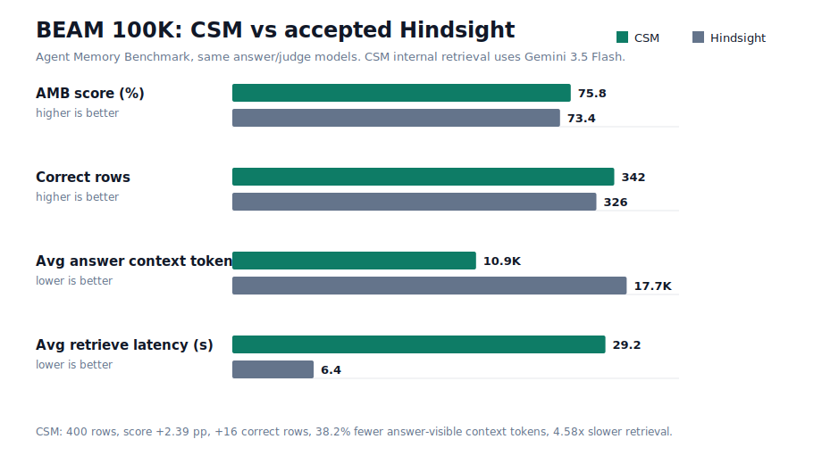

# BEAM 100K: CSM vs Hindsight

Status: completed local Agent Memory Benchmark run, 2026-05-27.

This is the first full, paired CSM-vs-Hindsight BEAM 100K comparison in this
repo. It is a scientific reporting artifact, not yet an externally accepted
leaderboard entry.

## Headline Result

| System | AMB memory | AMB mode | Score | Correct | Avg answer context | Avg retrieve latency |
|---|---|---|---:|---:|---:|---:|
| CSM | `csm` | `rag` | 0.757573 | 342 / 400 | 10,914 tokens | 29.230 s |
| Hindsight | `hindsight` | `single-query` | 0.733658 | 326 / 400 | 17,654.6 tokens | 6.379 s |

Delta: CSM is +0.023915 score, +16 correct rows, and uses 38.2% fewer
answer-visible context tokens than the accepted Hindsight artifact. CSM is also
4.58x slower on retrieval and spends additional internal shard tokens.



## Methods

- Dataset: BEAM.
- Split: 100K.
- Harness: Agent Memory Benchmark (AMB).
- Comparator artifact: `/private/tmp/agent-memory-benchmark/outputs/beam/hindsight/single-query/100k.json.gz`.
- CSM artifact: `data/eval/runs/amb-beam-100k-full-v4-official-models/amb-outputs/beam/csm-v4-official-models-full-100k/rag/100k.json`.
- CSM internal retrieval model: `gemini-3.5-flash`.
- AMB answer model for both rows: `gemini:gemini-3.1-pro-preview`.
- AMB judge model for both rows: `gemini:gemini-2.5-flash-lite`.
- CSM internal retrieval context cap: `CSM_AMB_MODEL_CONTEXT=8192`.
- CSM retrieval settings: `CSM_AMB_RETURN_K=24`, `CSM_AMB_SUMMARY_RETURN_K=24`,
  `CSM_AMB_REASONING_RETURN_K=32`, `CSM_AMB_NEIGHBOR_WINDOW=1`,
  `CSM_AMB_MAX_OUTPUT_TOKENS=512`.

The accepted Hindsight artifact is labeled `single-query` by AMB. CSM is labeled
`rag` because the CSM provider returns retrieved memory documents to AMB's
standard retrieval-answer-judge path. The dataset, split, answer model, judge
model, and scoring code are matched.

## Category Scores

| Category | CSM | Hindsight | Delta |
|---|---:|---:|---:|
| abstention | 1.000000 | 0.975000 | +0.025000 |
| contradiction_resolution | 0.650000 | 0.615625 | +0.034375 |
| event_ordering | 0.737517 | 0.804747 | -0.067230 |
| information_extraction | 0.756771 | 0.649479 | +0.107292 |
| instruction_following | 0.893750 | 0.912500 | -0.018750 |
| knowledge_update | 0.668750 | 0.587500 | +0.081250 |
| multi_session_reasoning | 0.547798 | 0.473810 | +0.073988 |
| preference_following | 0.975000 | 0.950000 | +0.025000 |
| summarization | 0.708646 | 0.792917 | -0.084271 |
| temporal_reasoning | 0.637500 | 0.575000 | +0.062500 |

CSM leads seven of ten categories. The clearest CSM wins are information
extraction, knowledge update, multi-session reasoning, and temporal reasoning.
The clearest losses are summarization and event ordering.

## Token Accounting

CSM token telemetry was joined from the final durable rows only:

- attempts 6 rows for BEAM units 1-5: 100 rows,
- attempt 7 rows for BEAM units 6-16: 220 rows,
- attempt 8 rows for BEAM unit 17: 20 rows,
- attempt 10 rows for BEAM units 18-20: 60 rows.

This accounts for all 400 unique query hashes.

| CSM telemetry field | Average / query | Total |
|---|---:|---:|
| AMB visible answer context | 10,914 | 4,365,600 |
| CSM internal total tokens | 23,551.125 | 9,420,450 |
| CSM internal input tokens | 21,019.820 | 8,407,928 |
| CSM internal output tokens | 2,531.305 | 1,012,522 |
| CSM internal pipeline input tokens | 13,884.575 | 5,553,830 |
| CSM internal pipeline output tokens | 2,512.773 | 1,005,109 |
| CSM discarded internal answer input tokens | 7,135.245 | 2,854,098 |
| CSM discarded internal answer output tokens | 18.533 | 7,413 |
| CSM internal + AMB visible context | 34,465.125 | 13,786,050 |

The total CSM number above includes all shard probe/recall/synthesis calls
reported by the CSM bridge sidecar, plus the internal CSM answer call that AMB
does not use. This prevents under-reporting CSM's cost. The accepted Hindsight
artifact reports AMB visible context and retrieval latency, but does not include
a symmetric Hindsight internal token sidecar.

## Runtime

- CSM final durable rows productive wall time: 20,951 seconds, or 5.82 hours.
- CSM average per-row AMB wall time from logs: 52.37 seconds.
- CSM median per-row AMB wall time from logs: 44.3 seconds.
- CSM max per-row AMB wall time from logs: 436.8 seconds.
- Hindsight wall-clock runtime is not present in the accepted artifact; the
  artifact does report 6.379 s average retrieval latency.

The full local process took longer than 5.82 hours because it was interrupted by
Gemini quota/credit stops and one transient Gemini transport disconnect. Those
attempt logs are preserved under
`data/eval/runs/amb-beam-100k-full-v4-official-models/`.

## Integrity And Leakage Audit

- The CSM bridge receives only AMB documents, the user-scoped query, optional
  user ID, and optional query timestamp.
- The retrieval script sets `correctAnswer` to `unused` and
  `relevantEventIds` to an empty array for the internal CSM baseline call.
- The evidence capsule is source-derived from retrieved/scoped memories and
  explicitly does not use gold answers or rubric text.
- `rg` over the saved run directory and the accepted Hindsight artifact found no
  API key patterns.

## Artifacts

| Artifact | SHA-256 |
|---|---|
| CSM raw AMB JSON | `11be07f7c4bf0638078433fe4832c375a1076f7267f3e4e876c04720785608c9` |
| Hindsight accepted AMB JSON gzip | `ee26d546c98b828a47046fc2374e9dd1531f68d0f27eaca12a68eb0f18e32cdc` |
| CSM attempt 6 token telemetry | `5d6759739909d4371b78f79606174c7d74eca37874a17e40f91eca781ce78453` |
| CSM attempt 7 token telemetry | `c9d76c7f9219b1861e4255b4000ab99fdbf7a0b3acba324e48bae822ea0ad035` |
| CSM attempt 8 token telemetry | `5a29f10fa07a1c42b49908fcc5857aabc8f9baab01733a1b539bd0553e4b8c41` |
| CSM attempt 10 token telemetry | `eda1c2b259646b453c1b639eaeb95e447e2c4497cb6fbc86b1e53b90637dc952` |

The committed summary artifact is
`data/eval/runs/sota-combined/amb-beam-100k-csm-vs-hindsight.json`.

## Reproduction Command

```bash
npm run amb:patch -- --amb-dir /private/tmp/agent-memory-benchmark

set -a
source .env
set +a

export PATH=/private/tmp/node-v24.16.0-darwin-arm64/bin:$PATH
export RUN_ROOT="$PWD/data/eval/runs/amb-beam-100k-full-v4-official-models"
export CSM_REPO_DIR="$PWD"
export CSM_PROVIDER=gemini
export CSM_AMB_MODEL=gemini-3.5-flash
export CSM_MODEL=gemini-3.5-flash
export CSM_GEMINI_MODEL=gemini-3.5-flash
export CSM_GEMINI_TIMEOUT_MS=600000
export CSM_GEMINI_MAX_RETRIES=2
export OMB_GEMINI_TIMEOUT_MS=600000
export CSM_AMB_MODEL_CONTEXT=8192
export CSM_AMB_MAX_OUTPUT_TOKENS=512
export CSM_AMB_RETRIEVE_TIMEOUT_SEC=900
export CSM_AMB_RETURN_K=24
export CSM_AMB_SUMMARY_RETURN_K=24
export CSM_AMB_REASONING_RETURN_K=32
export CSM_AMB_NEIGHBOR_WINDOW=1
export OMB_ANSWER_LLM=gemini
export OMB_ANSWER_MODEL=gemini-3.1-pro-preview
export OMB_JUDGE_LLM=gemini
export OMB_JUDGE_MODEL=gemini-2.5-flash-lite
export CSM_AMB_TELEMETRY_JSONL="$RUN_ROOT/csm-token-telemetry.jsonl"

/private/tmp/agent-memory-benchmark/.venv/bin/omb run \
  --dataset beam \
  --split 100k \
  --memory csm \
  --mode rag \
  --skip-ingested \
  --output-dir "$RUN_ROOT/amb-outputs" \
  --name csm-v4-official-models-full-100k
```

Use `--skip-ingested` only when resuming a durable AMB result JSON. For a fresh
reproduction, start from an empty output directory.

## Limitations

- This is one completed CSM run versus an accepted Hindsight artifact, not a
  repeated-run confidence interval.
- CSM's score is higher, but CSM is slower and uses additional internal shard
  tokens. That is a tradeoff, not a free win.
- Hindsight's accepted artifact does not expose internal token usage, so total
  token accounting is complete for CSM and incomplete for Hindsight.
- The result is ready for public reporting and official-chart submission work,
  but should not be described as an externally certified leaderboard placement
  until the official process accepts it.
